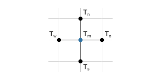

# PDEs

## Equazione di Laplace: Iterazioni di Jacobi

Consideriamo l'equazione di Laplace

<p align="center">
         [1]
</p>

in cui l'incognita  è una funzione di due variabili spaziali . L'equazione di Laplace [\[1\]](#laplaceEquation) modella lo steady state di una funzione, definita in uno dominio two-dimensional, che rappresenta una particolare grandezza fisica. In casi pratici,  può rappresentare il calore, e l'equazione [\[1\]](#laplaceEquation) può essere usata per studiare come il calore si distribuisce in un certo dominio, fissate che siano le condizioni al contorno

Se espandiamo l'operatore Laplaciano , otteniamo

<p align="center">
         [2]
</p>

Introduciamo a questo punto un grigliato di calcolo di  punti , con  ed , con  ed . Infine, indichiamo con  i valori dell'incognita nei punti del grigliato introdotto, ossia .

Approssimando le derivate contenute nella [\[2\]](#laplaceEquationExpanded) con differenze finite e assumendo , si ha il seguente sistema di  equazioni lineari algebriche

<p align="center">
         [3]
</p>

con  ed .

Il sistema [\[3\]](#laplaceEquationDiscretized) può essere risolto utilizzando il metodo di Jacobi. Quest'ultimo è un metodo iterativo per risolvere un sistema di  equazioni lineari in  incognite . Per illustrare il metodo di Jacobi, riscriviamo l'-ma equazione del sistema lineare come

<p align="center">
         [4]
</p>

where gli 's sono gli elementi della matrice  e gli 's sono gli elementi del vettore . Il valore di  può dunque essere espresso come

<p align="center">
         [5]
</p>

Il metodo Jacobi per risolvere un sistema di equazioni lineari definisce iterazioni per le quali, data la soluzione al passo -mo, diciamo , la soluzione al passo successivo viene espressa come

<p align="center">
         [6]
</p>

Ispirati dalla [\[6\]](#ithUnknownJacobi), il metodo di Jacobi per la soluzione numerica dell'equazione di Laplace consiste in:

<p align="center">
         [7]
</p>

La regola di update [\[7\]](#LaplaceJacobi) consiste dunque nel calcolo dello stencil nella figura seguente

<p align="center">
  
  <br>
     <em>Figure 1. Computational stencil for Laplace equation.</em>
</p>

where the south , north , west  and east  elements correspond to , ,  and .

Per una risoluzione univoca dell'equazione di Laplace, abbiamo bisogno di condizioni al contorno. In questo esempio, immagineremo di avere un pipe centrato in un punto di coordinate  e di raggio pari a  che scorre ortogonalmente al solution domain. Il pipe si troverà ad una temperatura pari a . Inoltre, i bordi sinistro, destro e superiore sono assunti avere una temperatura pari a , mentre il bordo inferiore è assunto avere una temperatura pari a . In questo modo, modellizziamo un pipe che scorre in aria e posizionato vicino al suolo.

Come initial guess del metodo iterativo, viene scelta una temperatura che soddisfa le condizioni al contorno e nel resto del dominio vale `T_{air}`.

### Iterazioni di Jacobi per l'equazione di Laplace: implementazione CPU

Come step preparatorio ad illustrare lo schema implementativo su GPU, illustriamone dapprima la soluzione CPU.

Il `main` program è il seguente:

``` c++
int main() {

	float* h_temperature = (float*)malloc(W * H * sizeof(float));
	float* h_temperature_new = (float*)malloc(W * H * sizeof(float));

	resetTemperatureCPU(h_temperature, W, H, bc);

	for (int iter = 0; iter < MAX_NUM_ITERS / 2; iter++) {
		temperatureUpdateCPU(h_temperature, h_temperature_new, W, H, bc);
		temperatureUpdateCPU(h_temperature_new, h_temperature, W, H, bc);
	}

	saveCPUrealtxt(h_temperature, ".\\CPU_result.txt", W * H);

	return 0;
}
```

Come si può vedere, vengono definite due matrici, cioè `h_temperature` ed `h_temperature_new`, di dimensioni `W` e `H`, che dovranno contenere la distribuzione di temperatura alla generica iterazione `k` e `k %2B 1`, rispettivamente. La funzione `resetTemperatureCPU` fissa il valore dell'inizial guess, mentre `temperatureUpdateCPU` effettua l'update della temperatura, ossia valuta la regola di aggiornamento [\[7\]](#LaplaceJacobi).


Assumendo  e ,  l'equazione [\[3\]](#heatEquationDiscretized) definisce la seguente formula di aggiornamento:

<p align="center">
         [4]
</p>

## Equazione del calore

Consideriamo l'equazione differenziale alle derivate parziali

<p align="center">
         [1]
</p>

in cui l'incognita  è una funzione di due variabili spaziali  e di una variabile temporale . Per una risoluzione univoca, abbiamo bisogno di una condizione iniziale e di condizioni al contorno. Ricordando di essere maggiormente interessati ad illustrare la tecnica programmativa di risoluzione di PDEs, non ci preoccuperemo di questo problema e fisseremo queste condizioni in seguito. Notiamo solo qui che, essendo capaci di risolvere l'equazione [\[1\]](#heatEquation), saremmo capaci di modellare la diffusione del calore in un determinato dominio bidimensionale.

https://www.dais.unive.it/~calpar/New_HPC_course/AA16-17/Project-Jacobi.pdf

https://skill-lync.com/student-projects/Steady-and-Transient-analysis-of-2D-heat-equation-with-implicit-and-explicit-methods-using-Jacobi-Gauss-Seidel-and-SOR-iterative-solvers-in-Matlab-15061

https://www.dsi.unive.it/~calpar/6_Progetto-02-03.pdf

